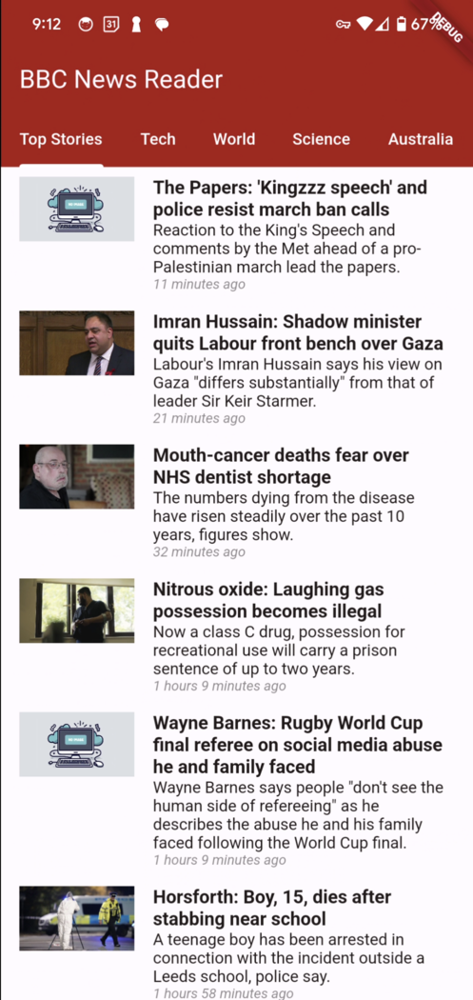
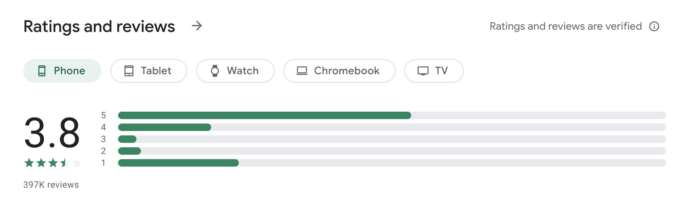
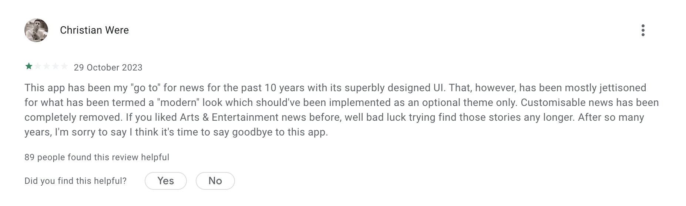
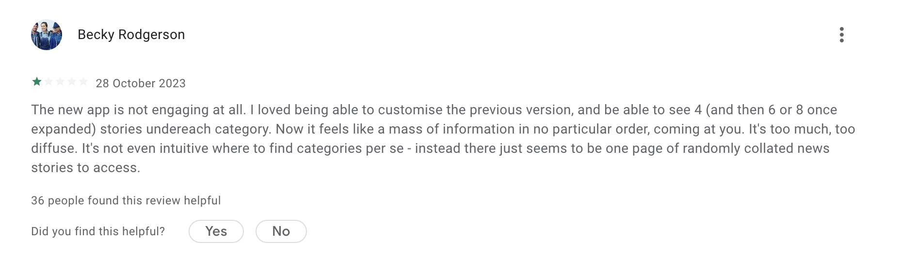
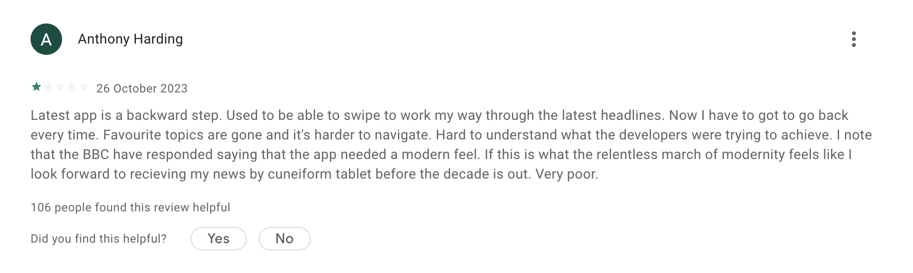

# Simple BBC News Reader

Click an image for a video demo.

| Home                             | Details                             |
| -------------------------------- | ----------------------------------- |
|     |   |

## Why

I, like many others, am not a fan of the latest update to the official BBC news app which removed the "my news" sections and made it impossible to easily browse all articles under a particular category such as "Technology".

Here are some of the recent ratings for the official BBC news:

This led me to build an alternate app for reading BBC news which provides a simpler layout using a tab for each different news category I'm interested in.